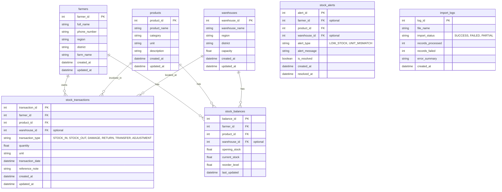

# Implementation Plan - Agriculture Stock Control Module

This implementation plan outlines the architecture, database design, directory structure, business logic, API endpoints, and validation rules for the Stock Control module. This module is designed for Ghana's agricultural context and is structured to be easily integrated into a larger platform.

---

## User Review Required

Please review the following design decisions and configurations:
> [!IMPORTANT]
> - **Database Backend**: SQLite is proposed for the standalone module to allow immediate running and testing without external dependencies. However, the schema is designed using SQLAlchemy so that your team can switch to PostgreSQL simply by updating the database URL in the environment variables.
> - **Unit Conversions**: We will implement a standard unit mapping helper. The base unit is stored on the product (e.g. `kg` or `liters`). Incoming transactions in other units (like `tons` or `bags`) will be converted using a conversion dictionary (e.g. `1 ton = 1000 kg`, `1 bag of grains = 50 kg` for Ghana standards). Unconvertible units will trigger a mismatch flag and log an error.
> - **Negative Stock Configuration**: An environment variable `ALLOW_NEGATIVE_STOCK` (default `False`) will govern the business logic. If `False`, any transaction that drives the stock balance below 0 will return a validation error (400) and prevent database commits.

---

## Proposed Project Folder Structure

The module will be located in the workspace under the `/app` and `/tests` directories:

```
c:\Users\ASUS\Desktop\agriculture database\
├── app/
│   ├── __init__.py
│   ├── main.py                     # FastAPI application setup
│   ├── config.py                   # Configuration and environment variables
│   ├── database.py                 # SQLAlchemy DB engine and session configuration
│   ├── models/
│   │   ├── __init__.py
│   │   └── stock_models.py         # SQLAlchemy DB models
│   ├── schemas/
│   │   ├── __init__.py
│   │   └── stock_schemas.py        # Pydantic schemas for API inputs/responses
│   ├── repositories/
│   │   ├── __init__.py
│   │   └── stock_repo.py           # CRUD and transaction handling
│   ├── services/
│   │   ├── __init__.py
│   │   ├── stock_service.py        # Balance calculation, stock movements, and alerts
│   │   ├── import_service.py       # Scanning, cleaning, deduplication, and mapping
│   │   └── forecast_service.py     # Forecasting baseline helper and placeholder
│   └── utils/
│       ├── __init__.py
│       └── unit_converter.py       # Safe unit conversion utility
├── tests/
│   ├── __init__.py
│   ├── conftest.py                 # Pytest fixtures and mock database
│   └── test_stock_control.py       # Core test cases
├── data/
│   ├── raw/                        # Target directory for raw data drops
│   ├── processed/                  # Processed/cleaned data dumps (optional)
│   └── error_logs/                 # CSV/Text files logging unimportable rows
├── requirements.txt                # Project dependencies (fastapi, pandas, sqlalchemy, pydantic, openpyxl, pytest)
├── run.py                          # Entry script to start the server
└── README.md                       # Setup and usage guide
```

---

## Proposed Database Design

The schema is fully normalized and maps to the requested structure:



---

## Data Cleaning & Import Pipeline (ImportService)

The import pipeline scans a specified directory (e.g. `data/raw/` or `datesets folder/`) and processes CSV/Excel files:
1. **Header Normalization**: Columns are trimmed, lowercased, and punctuation replaced with underscores (e.g., `Area (Ha)` -> `area_ha`, `Farmer Name` -> `farmer_name`).
2. **Type Mapping**: Values are converted dynamically. Empty rows or missing critical identifiers (like empty product name) are flagged.
3. **Data Quality Checks**:
   - Suspicious inputs (e.g. negative quantities where forbidden, impossible dates, missing identifiers) are skipped.
   - Row-level errors are written to `data/error_logs/` in a CSV format detailing `row_index, original_data, error_reason`.
4. **Fuzzy Matching Support**:
   - When a farmer or product name is imported, the pipeline performs a case-insensitive search.
   - If not found, it checks similarity using `difflib.get_close_matches`. If similarity is high (e.g. `> 0.8`), it raises a suggestion flag or logs it, requiring confirmation before merging, instead of silently creating duplicates.
5. **Deduplication**: Exact duplicates in the same file are dropped.
6. **Log Tracking**: Every run creates an `import_logs` record, reporting the outcome metrics to the caller.

---

## Core Business Logic (StockService)

- **Stock In / Stock Out**: Modifies inventory level. Decreases (out/damage/transfer) are deducted.
- **Stock Recalculation**: Current stock is recalculable at any time by executing:
  $$\text{Current Stock} = \text{Opening Stock} + \sum\text{Stock In} - \sum\text{Stock Out} - \sum\text{Damages} \pm \sum\text{Adjustments}$$
- **Low-Stock Alerting**: Every time a transaction is recorded, the `stock_balances` are updated. If the `current_stock` falls below or equal to `reorder_level`, a new active `stock_alerts` record is created (if one does not already exist for that farmer/product/location).
- **Unit Mismatch Alerting**: If a transaction unit does not match the product's base unit, the system tries to convert it. If conversion is impossible, a mismatch alert is triggered, and the transaction is flagged.

---

## API Endpoints Design

REST-style endpoints mapped in FastAPI:
- `POST /stock/in`: Record stock incoming.
- `POST /stock/out`: Record stock outgoing (validated against negative stock).
- `POST /stock/adjustment`: Register stock adjustment or damage report.
- `GET /stock/current`: Get all stock balances.
- `GET /stock/current/{farmer_id}`: Get balances for a specific farmer.
- `GET /stock/current/{farmer_id}/{product_id}`: Get balance of a product for a farmer.
- `GET /stock/transactions`: Trace transaction history (supports filters).
- `GET /stock/alerts`: Fetch active low-stock or unit mismatch alerts.
- `POST /stock/import`: Scan raw data directory and process datasets.
- `GET /stock/import/logs`: Fetch log details of past imports.
- `GET /stock/low-stock`: Get products currently below reorder levels.
- `GET /stock/forecast/{product_id}`: Baseline forecasting output (Moving Average / trend projection) incorporating historical facts.

---

## Verification Plan

### Automated Tests
We will build test suites under `/tests/test_stock_control.py` covering:
1. **Stock In Balance increase**: Verifying database balance matches expected sums.
2. **Stock Out Balance decrease**: Verifying subtraction works.
3. **Negative Stock prevention**: Attempting to deduct below zero yields HTTP 400 error when disabled.
4. **Low-Stock Alert trigger**: Deduction below reorder level inserts a row in `stock_alerts`.
5. **Deduplication & Error Handling in Import**: Passing duplicate records or rows with missing names maps cleanly to database or writes to error log.
6. **Stock Recalculation**: Invoking recalculation matches transactional sums.

### Manual Verification
1. Running `python run.py` and accessing the interactive FastAPI docs (`/docs` or `/redoc`) to test endpoints.
2. Importing seeded files and verifying database states and logs.
